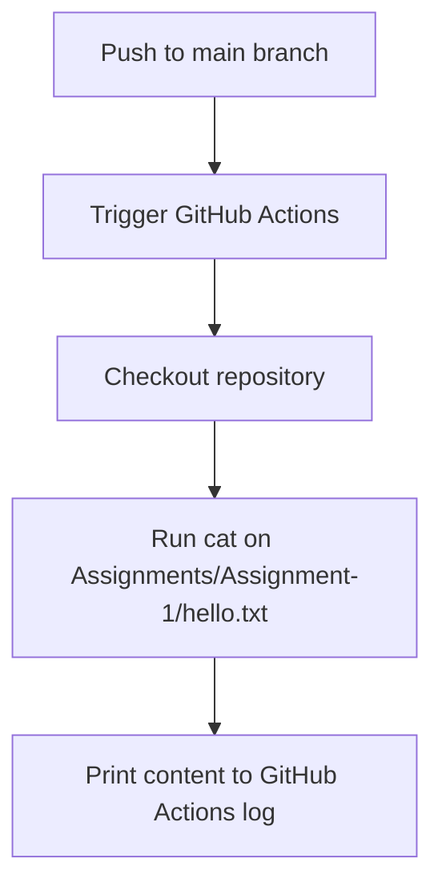

# Assignment-2: GitHub Actions - Print `hello.txt` Content

## í´� Overview

In this assignment, a GitHub Actions workflow was created to read and print the contents of a `hello.txt` file located in `Assignment-1`.  
This is triggered on every push to the `main` branch.

---

## í³‚ Project Structure

```plaintext
Ostad/
├── Assignments/
│   ├── Assignment-1/
│   │   └── hello.txt
│   └── Assignment-2/
│       └── README.md
├── .github/
│   └── workflows/
│       └── assignment-2-workflow.yml
```

---

## í´— Links

- í´— **Repository:** [https://github.com/Zamshed87/Ostad](https://github.com/Zamshed87/Ostad)
- ⚙� **Workflow File:** [https://github.com/Zamshed87/Ostad/blob/main/.github/workflows/assignment-2-workflow.yml](https://github.com/Zamshed87/Ostad/blob/main/.github/workflows/assignment-2-workflow.yml)

---

## ✅ Task Summary

- Use the existing `hello.txt` file from Assignment-1.
- Create a GitHub Actions workflow.
- Trigger the workflow on push to the `main` branch.
- Print the contents of the file in the workflow log.

---

## ⚙� GitHub Actions Workflow File

```yaml
name: Print hello.txt content

on:
  push:
    branches:
      - main

jobs:
  show-file-contents-Assignment-1:
    runs-on: ubuntu-latest
    steps:
      - name: Checkout repository
        uses: actions/checkout@v3

      - name: Print hello.txt content
        run: cat Assignments/Assignment-1/hello.txt
```

---

## í³¥ Sample Output in Workflow Log

```
Hello, i am adding my second operation in dev branch.
```

---

## í·  Mermaid Flow Diagram



---

## ✅ Conclusion

This assignment demonstrates how to automate reading and displaying file contents using GitHub Actions.  
It helps practice setting up CI/CD pipelines with custom steps triggered by repository activity.
